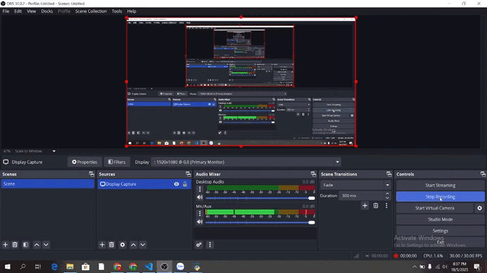

1. Mục tiêu

Trong quá trình học tập môn Trí tuệ nhân tạo (AI) ở trên trường, em đã được chỉ dạy rất nhiều các nhóm thuật toán khác nhau. Vì vậy để mô phỏng những kiến thức lý thuyết cũng như có những cái nhìn sinh động, chân thật về những nhóm thuật toán thì em đã có thực hiện một đồ án cá nhân nho nhỏ đó là mô phỏng trò chơi 8 puzzle, nơi mà em đã thực hiện giải trò chơi thông qua các nhóm thuật toán khác nhau nhằm đánh giá được hiệu suất cũng như cách vận hành của từng loại

2. Nội dung

Một bài toán tìm kiếm thông thường sẽ đƯợc định nghĩa bởi các thành phần sau xét theo lĩnh vực Trí tuệ nhân tạo và nếu trên khía cách là giải bài toán 8-puzzle thì sau đây là những điều chúng ta cần lưu ý.
- Không gian trạng thái : Tập hợp tất cả các trạng thái có thể đạt được. Đối với 8-puzzle, mỗi trạng thái là một cách sắp xếp cụ thể của 8 ô số và 1 ô trống trên lưới 3x3.
- Trạng thái ban đầu (Initial State)  : chính là trạng thái xuất phát của bài toán. Trong ứng dụng game trên, chúng ta có thể thiết lập, điều chỉnh trạng thái theo ý muốn hay sử dụng một trạng thái mặc định.
- Hành động (Actions):  Tập hợp các hành động có thể thực hiện để chuyển từ trạng thái này sang trạng thái khác. Với 8-puzzle, hành động là di chuyển ô trống lên, xuống, trái, phải.
- Mô hình chuyển đổi (Transition Model):  Một hàm `RESULT(s, a)` trả về trạng thái kết quả khi thực hiện hành động `a` từ trạng thái `s`.
- Trạng thái đích (Goal State) hoặc Phép thử đích (Goal Test):  Một hoặc nhiều trạng thái mong muốn đạt được, hoặc một hàm kiểm tra xem một trạng thái có phải là trạng thái đích hay không. Trong dự án này, trạng thái đích mong muốn luôn là `[[1, 2, 3], [4, 5, 6], [7, 8, 0]]`.
- Chi phí đường đi (Path Cost):  Một hàm gán chi phí cho một đường đi (chuỗi các hành động). Trong bài toán 8-puzzle cơ bản, mỗi bước di chuyển thường có chi phí là 1 tại vì đây là một ma trận dạng lưới (grid).

2.1. Các thuật toán tim kiếm có thông tin ( Uniformed Search)
  Nhóm thuật toán này sẽ bao gồm các nhóm thuật toán kinh điển như: 

2.1.1. Breadth-First Search (BFS)  - tìm kiếm theo chiều rộng
- Mô tả: Thuật toán duyệt hoặc mở rộng từ những nút nông trước (những nút kế bên nút được xét), sử dụng hàng đợi queue để xử lý các nút chờ được xét.
- Ứng dụng: Trực quan hóa quá trình BFS giải 8-puzzle có thể được thực hiện thông qua giao diện chính (`giaodien.py`).

2.1.2. Depth-First Search (DFS) - Tìm kiếm theo chiều sâu: 
- Mô tả: Mở rộng các nút sâu nhất trong cây tìm kiếm trước. Sử dụng một ngăn xếp (stack) để quản lý các nút chờ duyệt.
- Ứng dụng: Có thể quan sát trên giao diện chính (`giaodien.py`).

2.1.3. Uniform Cost Search (UCS) - Tìm kiếm theo chi phí thống nhất: 
- Mô tả: Mở rộng nút `n` có chi phí đường đi `g(n)` thấp nhất. Sử dụng hàng đợi ưu tiên. ,g(n) ở đây có thể hiểu là chi phí thực tế đã đi, trong game 8-puzzle là số trạng thái đạt được ( vì là dạng lưới (grid)).
- Ứng dụng: Có thể quan sát trên giao diện chính (`giaodien.py`).

2.1.4. Iterative Deepening DFS (IDDFS) - Tìm kiếm lặp sâu dần: 
- Mô tả: Kết hợp ưu điểm của DFS (ít tốn bộ nhớ) và BFS (tìm được lời giải nông nhất). Thực hiện DFS với giới hạn độ sâu tăng dần.
- Ứng dụng: Có thể quan sát trên giao diện chính (`giaodien.py`).

Trực quan hóa và So sánh hiệu suất (Đối với nhóm thuật toán không có thông tin):

- Với initial state (trạng thái ban đầu) mà em đã cho là [(1,2,3),(4,0,5),(6,7,8)] thì đây là hiệu suất của từng thuật toán trong nhóm trên ( ở đây là thời gian tìm được kết quả)

- Với trạng thái bắt đầu là như nhau, 3 thuật toán kia tìm ra được lời giải rất nhanh chóng riêng với thuật toán dfs ( do tính chất duyệt sâu) nên giải rất lâu và mất thời gian ( trường hợp chỉ là khách quan tại mới thử có 1 trạng thái ban đầu)

  Nhận xét về hiệu suất (Nhóm thuật toán không có thông tin trên 8-puzzle):
BFS:
    Tính đầy đủ (Completeness): Có (nếu không gian trạng thái hữu hạn).
    Tính tối ưu (Optimality): Có (nếu chi phí mỗi bước là như nhau, tìm ra lời giải nông nhất).
    Độ phức tạp thời gian và không gian:  `O(b^d)` với `b` là yếu tố nhánh và `d` là độ sâu của lời giải. Tốn nhiều bộ nhớ.
DFS:
    Tính đầy đủ: Không (có thể bị kẹt trong nhánh vô hạn nếu không cẩn thận hoặc không gian trạng thái vô hạn). Trong 8-puzzle (hữu hạn), nó sẽ tìm ra lời giải nếu có, nhưng có thể không phải là tối ưu.
    Tính tối ưu: Không.
    Độ phức tạp thời gian: `O(b^m)` với `m` là độ sâu tối đa của không gian trạng thái. 
    Độ phức tạp không gian:  `O(bm)` (tốt hơn BFS).
UCS:
    Tính đầy đủ: Có (nếu chi phí bước > 0).
    Tính tối ưu: Có.
    Độ phức tạp thời gian và không gian: Tương tự BFS nếu chi phí bước là đồng nhất ( vì đang chạy trên lưới (grid)), có thể tệ hơn nếu chi phí khác nhau nhiều (`O(b^(1 + C /ε))`, `C ` là chi phí lời giải tối ưu, `ε` là chi phí bước nhỏ nhất).
IDDFS:
    Tính đầy đủ: Có.
    Tính tối ưu: Có (tương tự BFS).
    Độ phức tạp thời gian: `O(b^d)`. 
    Độ phức tạp không gian: `O(bd)` (ưu điểm lớn). Mặc dù lặp lại việc duyệt các nút ở tầng trên, nhưng chi phí này không quá lớn so với tầng cuối cùng.

2.2. Nhóm 2: Tìm kiếm có thông tin (Informed Search / Heuristic Search)

Các thuật toán này sử dụng một hàm heuristic `h(n)` để ước lượng chi phí từ nút `n`, nút đang xét đến trạng thái đích. Điều này giúp hướng việc tìm kiếm về phía các trạng thái hứa hẹn hơn. Trong dự án này, hàm heuristic chính được sử dụng là khoảng cách Manhattan (`manhattan_distance` trong `thuattoan.py`) vì chúng ta chỉ chạy lên xuống sang trái phải vì đang trong biểu đồ lưới.

2.2.1. Greedy Search - Tìm kiếm tham lam: 
- Mô tả: Mở rộng nút có vẻ gần đích nhất theo hàm heuristic `h(n)`.
- Ứng dụng: Quan sát trên giao diện chính (`giaodien.py`).

2.2.2. A-Star Search: 
- Mô tả: Mở rộng nút có tổng `f(n) = g(n) + h(n)` nhỏ nhất, với `g(n)` là chi phí từ trạng thái đầu đến `n` ( ở đây có thể hiểu là chi phí đường đi), và `h(n)` là ước lượng chi phí từ `n` đến đích.
- Ứng dụng: Quan sát trên giao diện chính (`giaodien.py`).

2.2.3. Iterative Deepening A*  (IDA* ) - Tìm kiếm A*  lặp sâu dần: 
- Mô tả: Tương tự IDDFS nhưng thay vì giới hạn độ sâu, nó giới hạn tổng chi phí `f(n)`.
- Ứng dụng: Quan sát trên giao diện chính (`giaodien.py`).

Trực quan hoá
- Với initial state (trạng thái ban đầu) mà em đã cho là [(1,2,3),(4,0,5),(6,7,8)] thì đây là hiệu suất của từng thuật toán trong nhóm trên ( ở đây là thời gian tìm được kết quả):

- Chúng ta có thể thấy rằng do thuật toán greedy sử dụng hàm g(n) để đánh giá nên không tối ưu và mất tận 28 bước, 2 thuật toán như A* hay IDA* lại sử dụng công thức f(n) ( tổng chi phí thực tế - g(n) + chi phí ước lượng từ n đến đích (h(n)) nên luôn tìm được đường đi ngắn nhất, đảm bảm về mặt thời gian so với nhóm thuật toán thứ nhất)

Nhận xét về hiệu suất (Nhóm thuật toán tìm kiếm có thông tin trên 8-puzzle):

Greedy Search:
    Tính đầy đủ: Không (có thể bị kẹt hoặc đi vào vòng lặp).
    Tính tối ưu: Không.
    Độ phức tạp thời gian và không gian:  Trong trường hợp xấu nhất là `O(b^m)`, nhưng với heuristic tốt có thể cải thiện đáng kể.
A-Star Search:
    Tính đầy đủ: Có.
    Tính tối ưu:  Có (nếu `h(n)` là  admissible  - không đánh giá quá cao chi phí thực tế, và  consistent  - nếu `h(n) <= cost(n, n') + h(n')`). Khoảng cách Manhattan là admissible cho 8-puzzle.
    Độ phức tạp thời gian và không gian:  Phụ thuộc nhiều vào chất lượng của heuristic. Có thể vẫn là `O(b^d)` trong trường hợp xấu, nhưng thường tốt hơn nhiều so với tìm kiếm không thông tin. Tuy nhiên, vẫn lưu trữ tất cả các nút đã mở rộng.
IDA-Star :
    Tính đầy đủ: Có.
    Tính tối ưu: Có (với heuristic admissible).
    Độ phức tạp thời gian: Tương tự A\  nhưng có thể duyệt lại các nút. 
    Độ phức tạp không gian:  `O(bd)` (tương tự IDDFS, đây là ưu điểm lớn)

2.3. Nhóm 3: Tìm kiếm cục bộ (Local Search)

Các thuật toán này duyệt không gian trạng thái bằng cách chỉ giữ lại một trạng thái hiện tại và cố gắng cải thiện nó bằng cách di chuyển đến các trạng thái lân cận. Chúng không quan tâm đến đường đi đã qua. Thường dùng cho bài toán tối ưu hóa.

2.3.1. Hill Climbing - Leo đồi:
- Mô tả: Luôn di chuyển đến trạng thái lân cận tốt hơn (giá trị heuristic thấp hơn). Dễ bị mắc kẹt ở local optimum.
    Các biến thể được triển khai:
    Simple Hill Climbing (leo đồi đơn giản): Chọn láng giềng tốt hơn đầu tiên tìm thấy.
        

    Steepest-Ascent Hill Climbing (leo đồi dốc nhất): Chọn láng giềng tốt nhất trong tất cả các láng giềng.
        

    Stochastic Hill Climbing (leo đồi ngẫu nhiên): Chọn ngẫu nhiên trong số các láng giềng tốt hơn.
        

    Vì trạng thái ban đầu rất dễ ( chỉ cần 2 bước) nên tìm thấy lời giải rất nhanh

- Ứng dụng: Quan sát trên giao diện chính (`giaodien.py`).

2.3.2. Simulated Annealing - Luyện mô phỏng (Ủ men):
-Mô tả: Tương tự Hill Climbing nhưng cho phép di chuyển đến trạng thái xấu hơn với một xác suất nhất định, giảm dần theo "nhiệt độ" (temperature). Giúp thoát khỏi local optimum.
- Ứng dụng: Quan sát trên giao diện chính (`giaodien.py`).

2.3.3. Genetic Algorithms - Thuật toán Di truyền:
-Mô tả: Mô phỏng quá trình tiến hóa tự nhiên. Duy trì một "quần thể" (population) các trạng thái (nhiễm sắc thể). Tạo thế hệ mới bằng cách lai ghép (crossover) và đột biến (mutation) các cá thể tốt nhất.
- Ứng dụng: Quan sát trên giao diện chính (`giaodien.py`).

2.3.4. Beam Search - Tìm kiếm chùm tia:
-Mô tả: Giữ lại `k` trạng thái tốt nhất (chính là Beam-width trong code) ở mỗi bước mở rộng (thay vì chỉ 1 như Hill Climbing).
-Ứng dụng: Quan sát trên giao diện chính (`giaodien.py`).

Nhận xét về hiệu suất (Nhóm thuật toán leo đồi trên 8-puzzle): 

Hill Climbing (các biến thể): 
    Tính đầy đủ: Không (dễ bị kẹt ở local optimum, plateau).
    Tính tối ưu: Không.
    Độ phức tạp không gian: `O(1)` (chỉ lưu trạng thái hiện tại). Rất tiết kiệm bộ nhớ.
    Nhận xét: Nhanh nhưng chất lượng lời giải không đảm bảo. Với 8-puzzle, việc định nghĩa "láng giềng tốt hơn" dựa trên heuristic.
Simulated Annealing:
    Tính đầy đủ: Có thể tiến tới global optimum nếu nhiệt độ giảm đủ chậm (về mặt lý thuyết). Trong thực tế, phụ thuộc vào lịch trình giảm nhiệt.
    Tính tối ưu:  Không đảm bảo nhưng có khả năng tìm được lời giải tốt hơn Hill Climbing.
       Độ phức tạp không gian:  `O(1)`.
Genetic Algorithms: 
    Tính đầy đủ/Tối ưu:  Không đảm bảo, là một dạng tìm kiếm ngẫu nhiên có hướng. Chất lượng phụ thuộc vào kích thước quần thể, toán tử lai ghép/đột biến, số thế hệ.
    Độ phức tạp không gian:  Lưu trữ cả quần thể.
    Nhận xét:  Có thể khám phá không gian trạng thái rộng hơn, nhưng việc thiết kế hàm fitness và các toán tử cho 8-puzzle cần cẩn thận. Trong `thuattoan.py`, hàm fitness dựa trên việc mô phỏng đường đi và heuristic.
Beam Search: 
    Tính đầy đủ/Tối ưu:  Không đảm bảo (nếu lời giải tối ưu bị loại khỏi "chùm tia" ở bước nào đó).
    Độ phức tạp không gian:  `O(bk)` (`k` là kích thước chùm tia).
    Nhận xét:  Cải thiện so với Hill Climbing bằng cách giữ nhiều lựa chọn hơn.

2.4. Nhóm 4: Tìm kiếm trong môi trường phức tạp

Nhóm này bao gồm các thuật toán đối phó với các bài toán mà việc quan sát môi trường bị hạn chế hoặc bài toán có cấu trúc AND-OR.

2.4.1. Tree Search AND–OR (Cây tìm kiếm And-Or): 
- Mô tả:  Dùng cho các bài toán có thể được phân rã thành các bài toán con (AND nodes), hoặc có nhiều cách để giải quyết một bài toán con (OR nodes).
- Ứng dụng:  Project có một cửa sổ trực quan hóa riêng cho And-Or Search (`and_or_graph_visualization.py`), được gọi từ giao diện chính (`giaodien.py`). Thuật toán `and_or_search_visual` trong `thuattoan.py` cung cấp dữ liệu cho việc trực quan hóa này.

2.4.2. Partially Observable (Nhìn thấy một phần - "Niềm Tin 1 Phần"): 
- Mô tả:  Tác nhân không biết chắc chắn trạng thái hiện tại của mình mà duy trì một "trạng thái niềm tin" (belief state) - một tập hợp các trạng thái có thể. Hành động sẽ cập nhật trạng thái niềm tin này.
- Ứng dụng:  Được triển khai với giao diện riêng trong `niemtin_visual.py` (class `NiemTin` với `belief_type="PartialBelief"`), gọi từ `giaodien.py`.

2.4.3. Unknown or Dynamic Environment (Không nhìn thấy hoàn toàn – "Tìm kiếm trong môi trường niềm tin"): 
- Mô tả:  Tương tự như trên nhưng có thể phức tạp hơn, ví dụ tìm kiếm không cần cảm biến (sensorless) hoặc tìm kiếm tương hợp (conformant planning) - tìm một chuỗi hành động hoạt động đúng cho tất cả các trạng thái trong tập niềm tin ban đầu.
- Ứng dụng:  Được triển khai với giao diện riêng trong `niemtin_visual.py` (class `NiemTin` với `belief_type="Belief"`), gọi từ `giaodien.py`. File `thuattoan.py` cũng có một phần demo cho `conformant_bfs_8puzzle` (`search_no_observation`).

Nhận xét về hiệu suất (Nhóm 4 trên 8-puzzle): 
   And-Or Search:  Hiệu quả cho các bài toán có cấu trúc phù hợp. Độ phức tạp phụ thuộc vào cấu trúc của cây AND-OR.
   Tìm kiếm trong môi trường niềm tin:  Thường phức tạp hơn nhiều so với tìm kiếm trong môi trường quan sát được hoàn toàn, vì phải làm việc với tập hợp các trạng thái. Không gian trạng thái niềm tin có thể rất lớn. Các giải thuật như BFS tương hợp có thể được sử dụng.

2.5. Nhóm 5: Tìm kiếm trong môi trường có ràng buộc (Constraint Satisfaction Problems - CSP)

Các thuật toán này được thiết kế để giải quyết các Bài toán Thỏa mãn Ràng buộc, nơi mục tiêu là tìm một tập hợp các giá trị cho các biến sao cho tất cả các ràng buộc đều được thỏa mãn. Mặc dù 8-puzzle thường được giải bằng các thuật toán tìm kiếm trạng thái, việc áp dụng một số kỹ thuật CSP có thể thú vị, đặc biệt nếu có thêm các ràng buộc phụ. Project này đã tích hợp một số thuật toán từ một phiên bản Pygame, có một ràng buộc đặc biệt về vị trí tương đối của ô 3 và 6. Các thuật toán này được quản lý và trực quan hóa qua `csp_visualizer.py`.

2.5.1. Backtracking Search (Tìm kiếm quay lui - phiên bản CSP): 
- Mô tả:  Gán giá trị cho các biến một cách tuần tự. Nếu một phép gán dẫn đến vi phạm ràng buộc, hoặc không thể tìm thấy giá trị hợp lệ cho biến tiếp theo, thuật toán sẽ quay lui (backtrack) để thử giá trị khác cho biến trước đó. Phiên bản trong `thuattoan.py` (`backtracking_csp`) có thêm ràng buộc nếu ô 3 và 6 ban đầu kề nhau thì các nước đi phải duy trì điều đó.
- Ứng dụng:  Có thể chạy và quan sát thông qua `csp_visualizer.py`.

2.5.2. Forward Checking (Kiểm tra phía trước - phiên bản CSP): 
- Mô tả:  Một cải tiến của Backtracking. Khi một biến được gán giá trị, thuật toán kiểm tra các biến chưa được gán và loại bỏ các giá trị không tương thích với phép gán hiện tại từ miền giá trị của chúng. Phiên bản trong `thuattoan.py` (`forward_checking_csp`) chủ yếu dựa trên việc kiểm tra các trạng thái đã duyệt (visited set) theo logic từ code Pygame gốc.
- Ứng dụng:  Có thể chạy và quan sát thông qua `csp_visualizer.py`.

2.5.3. AC-3 (Arc Consistency Algorithm 3 - dùng để tạo bảng): 
Mô tả:  AC-3 là một thuật toán dùng để đảm bảo tính nhất quán cung (arc consistency) trong mạng ràng buộc, thường dùng để tiền xử lý CSP. Trong project này, một hàm có tên `AC3_Generate_Board` (được chuyển thành `ac3_generate_board_csp` trong `thuattoan.py`) được sử dụng để  tạo ra một trạng thái bàn cờ  8-puzzle ngẫu nhiên, giải được và có thêm ràng buộc là ô 3 và 6 phải kề nhau.
- Ứng dụng:  Chức năng tạo bảng này có trong `csp_visualizer.py`.

2.5.4. Min-Conflicts (Xung đột tối thiểu - phiên bản CSP): 
- Mô tả:  Một thuật toán tìm kiếm cục bộ cho CSP. Bắt đầu với một phép gán giá trị (có thể không thỏa mãn). Ở mỗi bước, chọn một biến vi phạm ràng buộc và gán cho nó giá trị làm giảm số lượng xung đột nhất.
- Ứng dụng:  Thuật toán `min_conflicts_csp` trong `thuattoan.py` được triển khai và có thể chạy qua `csp_visualizer.py`. Nó sử dụng heuristic Manhattan để đánh giá "xung đột".

 Nhận xét về hiệu suất (Nhóm 5 trên 8-puzzle với ràng buộc phụ): 

   Backtracking & Forward Checking:  Hiệu quả phụ thuộc nhiều vào thứ tự gán biến, thứ tự thử giá trị và hiệu quả của việc cắt tỉa. Ràng buộc phụ (như 3&6 kề nhau) có thể thu hẹp không gian tìm kiếm nhưng cũng có thể làm tăng độ phức tạp của việc kiểm tra ở mỗi bước. Các thuật toán này là đầy đủ (tìm ra lời giải nếu có).
   AC-3 (trong vai trò tạo bảng):  Mục đích là tạo ra các ca thử (test case) đặc biệt, không phải là giải thuật chính.
   Min-Conflicts:  Thường hiệu quả cho các CSP lớn. Không đầy đủ (có thể bị kẹt ở local minimum).

2.6. Nhóm 6: Học tăng cường (Reinforcement Learning)

Học tăng cường liên quan đến việc một tác nhân học cách hành xử trong một môi trường bằng cách thực hiện các hành động và nhận phản hồi (phần thưởng hoặc hình phạt).

2.6.1. Q-Learning: 
- Mô tả:  Một thuật toán học tăng cường không dựa trên mô hình (model-free). Nó học một hàm giá trị hành động (Q-function) `Q(s, a)` ước lượng giá trị kỳ vọng của việc thực hiện hành động `a` trong trạng thái `s` và sau đó tuân theo một chính sách tối ưu.
- Ứng dụng:  Được triển khai trong `thuattoan.py` (`q_learning_train_and_solve`) và có thể được chọn để giải 8-puzzle từ giao diện chính (`giaodien.py`). Quá trình này bao gồm giai đoạn huấn luyện (tạo bảng Q) và giai đoạn giải quyết dựa trên bảng Q đã học.

   Temporal Difference (TD) Learning: 
       Mô tả:  Đây là một lớp các phương pháp học tăng cường không cần mô hình, học từ kinh nghiệm bằng cách cập nhật ước lượng dựa trên các ước lượng khác (bootstrapping). Q-Learning là một dạng của TD Learning (cụ thể là TD control).
       Ứng dụng:  Project này triển khai Q-Learning. Mặc dù người dùng ghi chú "cái này chưa rõ", Q-Learning chính là một đại diện tiêu biểu và quan trọng của TD Learning. Không có một thuật toán TD Learning riêng biệt khác được triển khai cho 8-puzzle trong project này ngoài Q-Learning.

 Nhận xét về hiệu suất (Nhóm 6 trên 8-puzzle): 

   Q-Learning: 
       Học:  Quá trình học có thể tốn thời gian và tài nguyên (số episodes, kích thước bảng Q).
       Giải quyết:  Sau khi học, việc tìm đường đi từ bảng Q có thể nhanh nếu bảng Q tốt.
       Tính đầy đủ/Tối ưu:  Có thể hội tụ đến chính sách tối ưu nếu tất cả các cặp trạng thái-hành động được khám phá đủ nhiều và các tham số học (learning rate, discount factor) được chọn phù hợp.
       Nhận xét:  Với 8-puzzle, không gian trạng thái (181,440 trạng thái giải được) là quản lý được cho Q-Learning cơ bản, nhưng việc thiết kế phần thưởng và khám phá hiệu quả là quan trọng.

3. Kết luận
Dự án đã thành công trong việc triển khai một loạt các thuật toán tìm kiếm đa dạng để giải quyết bài toán 8-puzzle. Các kết quả chính đạt được bao gồm:

   Bộ sưu tập thuật toán phong phú:  Từ các thuật toán tìm kiếm cơ bản, nâng cao, tìm kiếm cục bộ, đến các thuật toán cho môi trường phức tạp và học tăng cường, cung cấp một cái nhìn tổng quan về các phương pháp tiếp cận khác nhau trong AI.
   Giao diện người dùng tương tác:  Ứng dụng GUI (`giaodien.py`) cho phép người dùng dễ dàng thử nghiệm các thuật toán, tùy chỉnh bài toán và quan sát kết quả một cách trực quan.
   Các module trực quan hóa chuyên biệt:  Việc xây dựng các cửa sổ riêng cho And-Or Search (`and_or_graph_visualization.py`), các thuật toán môi trường niềm tin (`niemtin_visual.py`), và các thuật toán CSP (`csp_visualizer.py`) giúp người dùng hiểu sâu hơn về cách hoạt động của từng loại thuật toán đặc thù.
   Nền tảng cho nghiên cứu và học tập:  Project này có thể được sử dụng như một công cụ học tập hiệu quả để tìm hiểu về các thuật toán tìm kiếm, hoặc làm nền tảng để phát triển và thử nghiệm các ý tưởng mới.

Qua việc thực hiện project, em có thể thấy rõ sự khác biệt về hiệu suất, tính đầy đủ, tính tối ưu và yêu cầu tài nguyên giữa các nhóm thuật toán khác nhau khi áp dụng cho cùng một bài toán. Việc lựa chọn thuật toán phù hợp phụ thuộc vào đặc điểm cụ thể của bài toán và các yêu cầu về lời giải.

 Hướng phát triển tiềm năng: 

  Bổ sung các heuristic phức tạp hơn cho tìm kiếm có thông tin.
  Triển khai các kỹ thuật cải tiến cho tìm kiếm cục bộ và học tăng cường.
  Thêm chức năng so sánh hiệu suất (thời gian, số bước, số nút đã duyệt) tự động giữa các thuật toán trên tập dữ liệu lớn.
  Cải thiện khả năng trực quan hóa và tương tác của giao diện người dùng.

